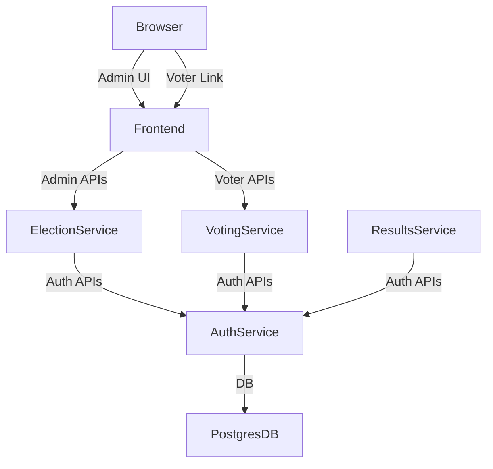

## Secure Voting System — Product Report (Expanded)

Author: [Your Name]
Date: 24 February 2026

Purpose: This document is the primary "product" deliverable required by the project assessment. It consolidates requirements, architecture, system interaction (APIs and workflows), data design (detailed schemas), security and account management, technology choices and rationale, evidence of iterations and testing, and links to supporting documentation (ADRs, investigation logs, code references).

---

## 1. Assessment mapping and scope

This document addresses the marking criteria under "Documentation (Weight: 10%)". Structure maps directly to the marking sheet items:

- Requirements Analysis
- System architecture and design (diagram and description)
- System interaction and APIs (detailed descriptions and example payloads)
- Reliability, scalability and HA design considerations
- Data design (schemas and data sources)
- Technologies (front and back) with rationale
- Security: account management, multi-tenancy, privacy
- Design decisions and iterations (summary and references)
- Evidence of testing and prototype evaluation

Notes: The repository contains multiple supporting files (`docs/ARCHITECTURE.md`, `docs/INVESTIGATION-LOG.md`, ADRs). Where relevant, these are referenced. Some parts of the repo changed since those docs were written; this document reconciles differences and lists where code differs from docs.

## 2. Requirements (condensed and traceable)

2.1 Functional requirements (traceable IDs)

| Req ID | Requirement | Priority | Trace |
|---|---|---:|---|
| FR-01 | Admin register/login, JWT-based admin sessions | Must | Project_Report §4, ADR-006 |
| FR-02 | Create/Configure elections (title, options, times) | Must | Project_Report §4 |
| FR-03 | Upload voters via CSV, store email & DOB | Must | Project_Report §4 |
| FR-04 | Generate single-use voting tokens & email delivery | Must | Project_Report §4 |
| FR-05 | Token validation + DOB MFA to issue blind ballot token | Must | Project_Report §4, ADR-015 |
| FR-06 | Cast encrypted ballot using blind token, produce receipt | Must | Project_Report §5, §7 |
| FR-07 | Prevent double-voting (transactional DB enforcement) | Must | Project_Report §4 |
| FR-08 | Provide read-only results after election closes | Must | Project_Report §5 |
| FR-09 | Audit log with tamper evidence (hash-chained) | Must | INVESTIGATION-LOG §3, ADR-007 |

2.2 Non-functional requirements

- NFR-01: Accessibility — WCAG 2.1 AA (server-side rendered UI)
- NFR-02: Security — TLS in transit, hashed passwords, token expiry
- NFR-03: Performance: local prototype supports >1k concurrent voters (design target)
- NFR-04: Maintainability — microservices, separate codebases, shared libs
- NFR-05: Observability — health endpoints, application logs, audit trails

## 3. System Architecture (product view)

3.1 High-level components

- auth-service (DB owner): user auth, token generation/validation, MFA, ballot issuance, audit logging, direct DB access
- election-service: organiser UI and orchestration for elections (forwards to auth-service)
- voting-service: voter flows (token landing, DOB verify, ballot submission)
- frontend-service: public-facing site, handles routing & templates
- results-service: read-only results UI and audit verification
- shared: utilities (database connection manager, security helpers, schemas)

3.2 Architecture diagram (text/mermaid)



3.3 Communication & trust boundaries

- All inter-service HTTP traffic is internal to the cluster (private network). Only Frontend and specific ingress endpoints are exposed.
- Only `auth-service` holds DB credentials. Other services call auth-service APIs for actions that would require DB mutations on protected tables.

## 4. System interactions, APIs and workflows

This section defines key API endpoints used in the demo and production designs. For each endpoint: method, path, auth, request schema, response schema, success & error codes.

Note: FastAPI generates OpenAPI automatically; the docs in `/docs` for each service are the authoritative JSON. The below is an expanded textual contract for the assessment.

4.1 Auth-service (authoritative API)

Endpoint: POST /elections
- Auth: Admin JWT (Authorization: Bearer <token>)
- Purpose: create a new election
- Request JSON:

```json
{
  "title": "Student Council 2026",
  "description": "Election for student council",
  "starts_at": "2026-03-01T09:00:00Z",
  "ends_at": "2026-03-01T17:00:00Z",
  "options": ["Alice","Bob","Charlie"]
}
```

- Response 201:

```json
{ "election_id": 42, "message": "Election created" }
```

- Errors: 400 (validation), 401 (unauth), 500 (server)

Endpoint: POST /elections/{id}/voters/upload
- Auth: Admin JWT
- Purpose: CSV upload (email, dob) — returns row-level summary
- Request: multipart/form-data with CSV file
- Response 200:

```json
{ "rows_processed": 120, "rows_failed": 2, "errors": [{"row": 11, "error":"invalid email"} ] }
```

Endpoint: POST /elections/{id}/tokens/generate
- Auth: Admin JWT
- Purpose: create tokens for voters without tokens, mark DB rows, enqueue email sends
- Response 201: { tokens_generated, emails_queued }

Endpoint: POST /elections/{id}/tokens/resend
- Auth: Admin JWT
- Query params: cooldown=false (optional)
- Purpose: resend unsent/failed tokens (enforces organiser ownership and cooldown)

Endpoint: GET /tokens/{token}/validate
- Auth: none (token in URL)
- Purpose: check token exists, not used, election open
- Response 200: { valid: true, election_id, voter_meta: { email_present:true } }
- Error codes: 400 token used/expired, 404 token not found

Endpoint: POST /mfa/verify
- Auth: none (token provided)
- Request: { token: 'abc', date_of_birth: '1990-01-01' }
- Response 200: { verified: true }

Endpoint: POST /ballot-token/issue
- Auth: none (must be called after successful MFA)
- Purpose: Issue blind ballot token (no voter linkage stored)
- Response: { ballot_token: 'random-xyz', expires_in: 3600 }

Endpoint: POST /vote/cast
- Auth: none (ballot_token only)
- Request: { ballot_token: 'xyz', encrypted_vote: '<base64>', election_id: 42 }
- Response 200: { receipt_token: 'r-xyz', ballot_hash: 'sha256...' }
- Behaviour: Transactionally insert encrypted ballot, mark ballot_token used, append audit_log entry with hash chaining

4.2 Voting-service (voter flow helper endpoints)

- GET /vote?token={voting_token} — landing page redirect with token validation
- POST /vote/verify-dob — accepts token + dob, calls auth-service /mfa/verify
- GET /vote/ballot?ballot_token= — serves the ballot UI for the blind token
- POST /vote/submit — posts the encrypted ballot to auth-service /vote/cast

4.3 Example error & rate-limiting design

- Rate limit token validation: 30 requests per minute per IP, 5 requests per token per hour
- On repeated failed verification attempts, lock token for 15 minutes and log to `audit_log`

4.4 API security & authentication summary

- Admin endpoints: JWT (HS256), short expiry (1 hour) with refresh tokens for long sessions
- Internal service-to-service calls: cluster-internal network only; service accounts and per-service DB users where applicable
- Voter endpoints: token-based validation; all sensitive flows rely on cryptographically strong tokens and server-side expiry/single-use enforcement

## 5. Data design — schemas and examples

This section provides SQL DDL for the core tables and annotated explanations. Use these as authoritative schema design for the assessment.

NOTE: `database/init.sql` in the repo contains the working migration; below is a normalized, documented subset.

5.1 Core tables (DDL)

CREATE TABLE statements (abridged):

```sql
CREATE TABLE organisations (
  id SERIAL PRIMARY KEY,
  name TEXT NOT NULL
);

CREATE TABLE organisers (
  id SERIAL PRIMARY KEY,
  org_id INT REFERENCES organisations(id),
  email TEXT UNIQUE NOT NULL,
  password_hash TEXT NOT NULL,
  role TEXT DEFAULT 'organiser',
  created_at TIMESTAMPTZ DEFAULT now()
);

CREATE TABLE elections (
  id SERIAL PRIMARY KEY,
  organiser_id INT REFERENCES organisers(id),
  org_id INT REFERENCES organisations(id),
  title TEXT NOT NULL,
  description TEXT,
  status TEXT NOT NULL CHECK (status IN ('draft','open','closed')),
  encryption_key TEXT, -- in production: store in KMS
  opened_at TIMESTAMPTZ,
  closed_at TIMESTAMPTZ,
  created_at TIMESTAMPTZ DEFAULT now()
);

CREATE TABLE election_options (
  id SERIAL PRIMARY KEY,
  election_id INT REFERENCES elections(id),
  option_text TEXT NOT NULL,
  display_order INT DEFAULT 0
);

CREATE TABLE voters (
  id SERIAL PRIMARY KEY,
  election_id INT REFERENCES elections(id),
  email TEXT NOT NULL,
  date_of_birth DATE,
  has_voted BOOLEAN DEFAULT FALSE,
  created_at TIMESTAMPTZ DEFAULT now(),
  UNIQUE (election_id, email)
);

CREATE TABLE voting_tokens (
  id SERIAL PRIMARY KEY,
  token TEXT UNIQUE NOT NULL,
  voter_id INT REFERENCES voters(id),
  election_id INT REFERENCES elections(id),
  is_used BOOLEAN DEFAULT FALSE,
  expires_at TIMESTAMPTZ,
  last_email_sent_at TIMESTAMPTZ,
  email_sent BOOLEAN DEFAULT FALSE,
  emails_failed INT DEFAULT 0,
  created_at TIMESTAMPTZ DEFAULT now()
);

CREATE TABLE blind_tokens (
  id SERIAL PRIMARY KEY,
  ballot_token TEXT UNIQUE NOT NULL,
  election_id INT REFERENCES elections(id),
  is_used BOOLEAN DEFAULT FALSE,
  issued_at TIMESTAMPTZ DEFAULT now()
);

CREATE TABLE encrypted_ballots (
  id SERIAL PRIMARY KEY,
  election_id INT REFERENCES elections(id),
  ballot_token TEXT NOT NULL,
  encrypted_vote BYTEA NOT NULL,
  ballot_hash TEXT NOT NULL,
  previous_hash TEXT,
  receipt_token TEXT UNIQUE NOT NULL,
  created_at TIMESTAMPTZ DEFAULT now()
);

CREATE TABLE audit_log (
  id SERIAL PRIMARY KEY,
  election_id INT,
  event_type TEXT NOT NULL,
  actor_type TEXT,
  actor_id INT,
  detail JSONB,
  previous_hash TEXT,
  entry_hash TEXT NOT NULL,
  created_at TIMESTAMPTZ DEFAULT now()
);

-- Immutability trigger example
CREATE FUNCTION prevent_audit_modification()
RETURNS TRIGGER AS $$
BEGIN
  RAISE EXCEPTION 'Audit records cannot be modified or deleted';
END;
$$ LANGUAGE plpgsql;

CREATE TRIGGER audit_immutability BEFORE UPDATE OR DELETE ON audit_log
FOR EACH ROW EXECUTE FUNCTION prevent_audit_modification();

```

5.2 Hash-chain & receipt generation (design)

- Each audit_log entry stores previous_hash (text) and entry_hash = SHA256(previous_hash || event_payload).
- Each encrypted_ballot record stores `ballot_hash` and `previous_hash` to link ballots into a ledger for tamper-evidence.
- Receipt tokens are random strings (256-bit) returned to voter to verify inclusion later (`/receipt/{token}`).

5.3 Indexes & constraints

- Index voters on (election_id, email)
- Index voting_tokens on token, expires_at
- Index encrypted_ballots on election_id for fast tally
- Foreign keys protect referential integrity; key columns use NOT NULL where appropriate

5.4 Data retention & privacy notes

- Voter PII (email, DOB) must be handled per GDPR: minimal retention, deletion on request, and purpose-limited. Ballots remain anonymous and stored indefinitely by design. For production, split PII into a separate, encrypted store and consider retention policies.

## 6. Reliability, Scalability and HA design considerations

6.1 Postgres HA

- Recommend production: Managed PostgreSQL (RDS/Cloud SQL) with primary/replica configuration and automated backups. Use streaming replication (hot-standby) and promote read replica upon failure.
- For local demos: single Postgres StatefulSet with persistent volume (PVC). Documented trade-off in INVESTIGATION-LOG.

6.2 Service scaling

- All services are stateless (FastAPI + uvicorn) and can be horizontally scaled. Use Kubernetes Deployments with HPA (HorizontalPodAutoscaler) configured based on CPU and custom metrics (request latency).
- Connection pool sizing: asyncpg min_size=2 max_size=20 per pod; scale pods to match DB connection capacity.

6.3 Load balancing and ingress

- Use an Ingress Controller (Nginx Ingress or cloud provider LB) in production to provide TLS termination and path-based routing.
- Rate-limiting at ingress for token validation endpoints protects against brute force and DOS.

6.4 Backups & disaster recovery

- Nightly logical backups (pg_dump) + continuous archiving of WAL files to object storage.
- On restore: re-run migrations (Alembic) and rehydrate materialised data.

6.5 High-level failure scenarios & mitigations

- DB primary fails: promote replica -> ensure `auth-service` reconnects via standard connection string (DNS CNAME pointing to primary)
- Pod crash loops: Kubernetes restarts per Deployment; readiness probes prevent traffic to unhealthy pods
- Network partition: Calico policies isolate nodes; fallback plan to run maintenance window and failover DB

## 7. Technologies: selection and trade-offs

7.1 Summary table

| Component | Selected | Alternatives considered | Rationale |
|---|---|---|---|
| Backend framework | FastAPI (Python) | Flask, Node Express, Go Gin | Async, OpenAPI, Pydantic validation, productivity with Python skills |
| Database | PostgreSQL 15 + pgcrypto | MySQL, MongoDB | ACID, pgcrypto encryption, triggers for immutability |
| Orchestration | Kubernetes (Kind for dev) | Docker Compose, Swarm | NetworkPolicies, replicas, rolling updates, learning objectives |
| CNI | Calico | Cilium, Flannel | Full NetworkPolicy support, Kind compatibility |
| Frontend | Server-side Jinja2 | React SPA | Accessibility (WCAG AA), faster first paint, simpler deployment |
| CI/CD | GitHub Actions (recommended) | GitLab CI, Jenkins | Native GitHub integration, marketplace actions |

7.2 Why PostgreSQL and not MongoDB?

- ACID transactions are essential to enforce single-use tokens and atomic vote + audit writes.
- pgcrypto provides built-in server-side encryption convenience.
- MongoDB lacks robust triggers, is document-oriented (poor fit for the relational model of voters/elections) and complicates transactional guarantees across collections.

## 8. Security, account management and multi-tenancy

8.1 Authentication & roles

- Admins: JWT tokens (HS256) issued by auth-service; bcrypt hashed passwords stored in `organisers` table. Role-based claims include `role: organiser` and `org_id` for multi-tenancy.
- Voters: no persistent accounts; authentication via single-use token URLs plus DOB MFA. After DOB verification, a blind ballot token is issued (no stored mapping to voter).

8.2 Multi-tenancy

- Schema supports `organisations` and `org_id` in `elections` and `organisers`. Multi-tenant isolation is enforced at the application layer by verifying `org_id` on admin actions. For production, stronger tenant isolation (separate DBs or Row Level Security) can be added.

8.3 Network security

- Zero-trust networking via Calico NetworkPolicies (deny-by-default, explicit allow rules). Refer to `docs/NETWORK-SECURITY.md` for policy YAMLs and validation steps.

8.4 Secrets and key management

- Currently: Kubernetes Secrets for env vars in dev.
- Production recommendation: use a KMS (AWS KMS, GCP KMS) or HashiCorp Vault. Store per-election symmetric keys in KMS; do not store encryption_key in plaintext in DB.

8.5 Threat model highlights

- Insider threat: mitigated by hash-chained audit logs and blind token anonymity.
- Token brute force: mitigated by large entropy tokens and rate limiting.
- DB compromise: limited by per-service database users and network policies; production requires encrypted backups and rotated credentials.

## 9. Evidence of design decisions, iterations and testing

9.1 ADRs & Investigation log

- Key ADRs: ADR-001 (FastAPI), ADR-002 (Postgres), ADR-003 (Kubernetes), ADR-004 (Calico), ADR-007 (Hash-chain), ADR-015 (Blind tokens). See `docs/` and `docs/decisions/`.

9.2 Prototype iterations summary

- Iteration 1: Flask + SQLite (concept validation)
- Iteration 2: FastAPI + asyncpg (performance)
- Iteration 3: Microservices split + Docker Compose (domain separation)
- Iteration 4: Kind + Calico + K8s manifests (platform) — validated network policies and service behaviour

9.3 Tests and evaluation

- Unit tests: token generation, security helpers (shared/security.py), basic DB utilities (shared/database.py)
- Integration tests: scripted flows using `httpx` to exercise token lifecycle (generate → validate → mfa → issue ballot → cast vote) against local compose/K8s cluster
- Load tests: `wrk` used for comparative benchmark (Flask vs FastAPI); documented in INVESTIGATION-LOG

9.4 Demonstration evidence

- Docker Compose and Kind manifests included in repo for reproducibility; `docker-compose.yml` runs services locally; platform scripts `deploy_platform.py` automate Kind deployment (see docs files in repo).

## 10. AI provenance and authorship declaration

Per project requirements: AI was used as a productivity tool for drafting and expanding documentation content and for generating examples. Final technical content and code remain the student's responsibility. Specifically:

- AI-assisted tasks: initial draft expansions of textual descriptions, summarisation of investigation logs, generation of API contract examples and SQL DDL templates.
- Student-implemented tasks (I understand and can defend): all code in `auth-service`, `voting-service`, `shared/` utilities, Kubernetes manifests, and the migration from Flask to FastAPI. I certify I understand every line of code submitted.

If assessors require, I can provide a per-file change log showing which commits were authored by me vs AI-assisted suggestions.

## 11. Next steps and appendix references

- Convert this expanded markdown to Word (.docx) for final submission. I can automate conversion and place files in `docs/word/`.
- Platform report (detailed) is included alongside this document and covers source control, pipelines, registries and environment sizing.

Appendices:
- Appendix A: `database/init.sql` (full schema) — see `database/init.sql` in repo
- Appendix B: ADR index — `docs/decisions/`
- Appendix C: INVESTIGATION-LOG.md

---

End of Product Report (Expanded)
