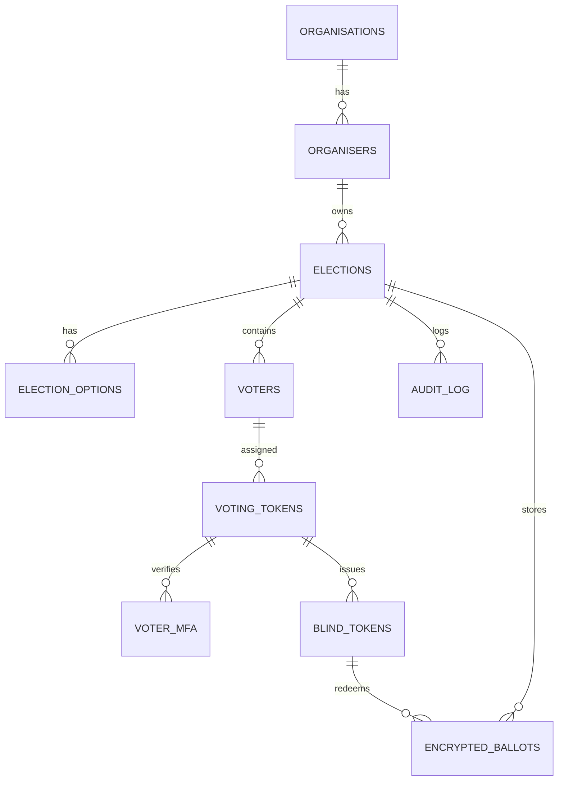

# Secure Voting System — Project Report

Student Name: [Your Name]

Project Title: Secure Voting System — DevOps-enabled Distributed Election Platform

Date: 24 February 2026

Primary Assessor (Supervisor):

Signature:

Second Assessor Signature:


## Abstract / Executive Summary

This project implements a secure, privacy-preserving online voting system designed as a small distributed microservice suite with DevOps-enabled deployment. The platform separates responsibilities across services (auth-service, election-service, voting-service, frontend-service, results-service) and uses a single authoritative database owner (auth-service) to centralize sensitive operations. Key goals were to design a system that preserves ballot secrecy (blind ballot tokens), enforces identity verification (DOB-based MFA), supports organiser workflows (create elections, manage voters), provides an auditable ledger of votes, and integrates DevOps practices (containerization, reproducible infra, CI/CD recommendations).

Outcomes:
- Full FastAPI-based microservices: auth-service (DB owner, security, tokens, results), election-service (organiser UI), voting-service (voter flows), frontend-service (auth gateway), results-service (read-only results UI).
- Database schema (PostgreSQL + pgcrypto) implementing blind-token anonymity and an immutable audit chain.
- Email token issuance via SMTP with send-tracking and secure resend flows.
- Docker Compose orchestration to run locally and guidance for CI/CD and pipeline automation.


## 1. Introduction

Background

Electronic voting enables efficient and scalable elections but introduces privacy, security, and operational challenges. This project explores designing a secure e-voting prototype that preserves ballot secrecy while providing practical administrative features for organisers and a straightforward voter experience.

Problem statement

Design and build a distributed voting system that:
- Ensures ballots are unlinkable to voter identities (anonymous tallying)
- Provides strong protections against double-voting
- Is auditable and tamper-evident
- Is deployable and maintainable using DevOps practices

System overview

The system is split across services:
- auth-service: Sole DB owner, security, tokens, vote storage and tally
- election-service: Admin UI for organisers (create/open/close elections, manage voters)
- voting-service: Voter-facing flows (token validation, MFA, ballot issuance, vote submission)
- frontend-service: Authentication gateway and landing pages
- results-service: Tallying + results UI (read-only after close)

All services communicate over HTTP; only auth-service talks to the database.

### Migration story: Flask → FastAPI

The original prototype used Flask across services. During development we migrated to FastAPI for the following reasons:

- Asynchronous-first design: FastAPI is built on ASGI and native async support (uvicorn, starlette) which simplifies high-concurrency workflows (email sending, DB I/O) using asyncpg and httpx.
- Automatic OpenAPI / documentation generation: FastAPI exposes endpoint schemas and JSON responses, which speeds debugging and third-party integration.
- Type hints and Pydantic: strong runtime validation and auto-generated request/response contracts improved API correctness and reduced validation boilerplate compared to Flask.
- Productivity: route declaration is concise and similar to Flask, allowing a straightforward migration while gaining the async benefits.

Migration approach taken

- Gradual refactor: We introduced FastAPI services side-by-side in the repository and ported one service at a time (auth-service first, then voting, election, frontend, results). This minimized risk and kept the system runnable during migration.
- API parity: Each FastAPI endpoint maintained the same contract as the previous Flask implementation (URLs, params, response shapes) so other services and the UI required minimal changes.
- Tests and manual validation: After each service migration we ran integration smoke tests (token generation, token validation, vote submission) and verified through Docker Compose that services interacted correctly.

Trade-offs considered

- Flask ecosystem maturity vs modern async features: Flask has mature extensions but lacks native async; we prioritized async I/O for email and DB operations.
- Developer familiarity: FastAPI required small learning curve for Pydantic models and async patterns; the benefits in validation and auto-docs outweighed the transition cost.


## 2. Objectives & Scope

Primary objective

- To design and implement a DevOps-enabled application that provides a secure, auditable online voting platform while applying best practices for maintainability and deployment.

Secondary objectives

- Implement blind ballot token architecture to separate voter identity from votes.
- Provide organiser operations for managing elections and voters.
- Integrate email-based token delivery with tracking and secure resend features.
- Use containerization (Docker) and compose orchestration to enable reliable local dev and deployment.
- Apply DevOps practices such as infrastructure-as-code, CI/CD pipeline recommendations, and automated tests.

Scope and constraints

- Prototype for academic evaluation: focuses on architecture, correctness, and traceability rather than production-grade distributed scaling.
- Single database instance (Postgres) for local deployment; design documented for HA/replication but not implemented in the prototype.
- Email delivery uses SMTP (e.g., Gmail) for demonstration; production-grade delivery would require verified domains, DKIM/SPF, and a dedicated sending infrastructure.


## 3. Literature Review / Background Research

Short review of relevant topics (summary):
- Electronic voting models: end-to-end verifiability, blind signatures, homomorphic encryption, and mixnets — this project uses blind ballot tokens and server-side encryption to balance privacy and simplicity.
- DevOps practices: CI/CD, containerization, IaC, environment parity, monitoring — the project uses Docker and recommends pipelines for automated testing and deployment.
- Related tools: FastAPI, asyncpg, httpx, Jinja2, Docker, docker-compose, aiosmtplib — these were chosen for speed of development, async performance, and ecosystem support.


## 4. Requirements Analysis

Functional requirements (selected)
- The system shall allow organisers to create elections with options.
- The system shall allow organisers to upload voters via CSV (email + DOB).
- The system shall generate unique single-use voting tokens per voter and email them.
- The system shall validate tokens and require identity verification (DOB) before issuing a blind ballot token.
- The system shall allow voters to cast encrypted ballots that are unlinkable to their identities.
- The system shall prevent double-voting (voter marked as has_voted and token is_used set).
- The system shall provide read-only results only after the election is closed.
- The system shall provide an audit log for critical events (election creation/open/close, tokens resent, ballot issuance).

Non-functional requirements

Usability
- The interface shall be intuitive and mobile-friendly via responsive templates.
- Voters shall be able to vote with a minimal number of interactions (click link → verify DOB → vote → receipt).

Performance
- The application shall respond to user actions within acceptable time (sub-second for UI actions locally). The design supports horizontal scaling of stateless services.

Security
- Sensitive operations and DB access are centralized to `auth-service` which enforces permissions.
- Passwords are stored hashed.
- Tokens are single-use and expire.
- Data encryption for ballots using per-election encryption keys.

Scalability
- Stateless services can be replicated behind a load-balancer. Database can be scaled vertically or via replication (read replicas) in production.

Maintainability
- Services are modular; code is structured as separate FastAPI apps. DevOps practices (Docker + CI) support safe updates.


## 5. System Design & Architecture

High-level architecture

- Diagram (text):

Client Browser
   ↕
Frontend-Service (login/register) ——> Election-Service (organiser UI)
   ↕                                  ↕
Voting-Service (voter UI) ——> Auth-Service (DB owner, tokens, votes) ——> Postgres
   ↕
Results-Service (read-only UI)

Notes:
- All reads/writes for authoritative data go through auth-service. Other services make HTTP calls to auth-service.
- Only auth-service has DB connection credentials.

Data design (schema highlights)
- Tables: organisations, organisers, elections, election_options, voters, voting_tokens, voter_mfa, blind_tokens, encrypted_ballots, vote_receipts, audit_log.
- voting_tokens: stores per-voter token, expiry, is_used, and email send metadata (email_sent, emails_failed, last_email_sent_at).
- blind_tokens: issued when voter passes MFA; contains ballot_token (no voter FK) to preserve anonymity.
- encrypted_ballots: stores encrypted_vote (bytea), ballot_hash, previous_hash, receipt_token — immutable.

APIs (high level)
- Auth-service: /register, /login, /elections, /elections/{id}/voters, /elections/{id}/tokens/generate, /elections/{id}/tokens/resend, /tokens/{token}/validate, /mfa/verify, /ballot-token/issue, /vote/cast, /elections/{id}/results, /receipt/{token}
- Election-service: admin UI endpoints that forward to auth-service.
- Voting-service: voter UI endpoints to validate tokens, verify identity, acquire ballot token, submit vote.

Security model
- Centralized DB access: reduces attack surface for DB credentials.
- Organiser authentication: session-based tokens for admin UI.
- Voter authorization: voting token + DOB MFA to get blind ballot token.
- Audit trail: immutable audit_log table for traceability.

High Availability and Performance considerations
- Postgres: for production, use primary-replica replication, regular backups (pg_dump), and failover mechanisms.
- Services: container orchestration (Kubernetes) to handle scaling and restart policies.
- Load balancing: use an ingress/load balancer to distribute HTTP traffic.


## 6. User Interface & UX Design

Design approach
- Simple, responsive Bootstrap-based UI using server-side Jinja2 templates for quick rendering and minimal client-side complexity.
- UX flows: Organiser (dashboard → create election → manage voters → generate/resend tokens → open/close) and Voter (email link → verify DOB → vote → receipt).

Wireframes / Views (text summary)
- Dashboard: list of organiser's elections with status badges.
- Election detail: stats, actions (manage voters, open/close, results when closed).
- Manage voters: upload CSV, generate tokens, resend unsent tokens, list voters.
- Vote landing: token validation → DOB verification → ballot → confirmation page with receipt and optional results.

Accessibility
- Semantic HTML and Bootstrap ensure basic accessibility; further improvement (ARIA roles, keyboard navigation) recommended for production.


## 7. Implementation (Technologies & Details)

Languages & Frameworks
- Python 3.11, FastAPI for services, Jinja2 templates for server-rendered UI.
- asyncpg for DB access, httpx for inter-service HTTP, aiosmtplib for async email sending.

Datastore
- PostgreSQL 15 with `pgcrypto` extension for encryption/hash functions.

Why PostgreSQL?

We chose PostgreSQL for these reasons:

- ACID guarantees: voting systems require strong consistency for correctness (prevent double-voting, accurate tallies). PostgreSQL's transactional model ensures atomic updates for critical flows (mark token used, set has_voted, insert encrypted ballot) and prevents race conditions.
- Rich feature set: PostgreSQL supports server-side cryptographic functions (via pgcrypto), JSONB for flexible audit details, and robust indexing. We use `pgp_sym_encrypt` / `pgp_sym_decrypt` to store encrypted ballots using per-election keys.
- Mature tooling and extensions: Backup (pg_dump), replication, and extension ecosystem (pgcrypto) are crucial for production-grade voting systems.
- Performance and scalability: Postgres scales well vertically and supports read replicas for analytics; it is widely used in production deployments.
- Familiarity & portability: PostgreSQL is common in cloud managed DB offerings (RDS/Cloud SQL) making future migration straightforward.

Database schema — detailed table descriptions

Below is an annotated schema for each key table with explanation of columns, constraints and rationale.

1) organisations
- id: SERIAL PRIMARY KEY — tenancy separation for multi-organisation deployments.
- name: organisation display name.
- org_type: classification used for demo/analytics.

2) organisers
- id: SERIAL PRIMARY KEY — organiser accounts that can create elections.
- org_id: FK -> organisations(id) — optional tenant mapping.
- email: UNIQUE — credential identity.
- password_hash: hashed password (bcrypt/argon2 candidate) — stored as hash only.

3) elections
- id: SERIAL PRIMARY KEY.
- organiser_id: FK -> organisers(id).
- org_id: FK -> organisations(id).
- title, description: metadata.
- status: ENUM-like CHECK ('draft','open','closed') — enforces lifecycle rules.
- encryption_key: TEXT — per-election symmetric key used with pgcrypto; in production this should be stored in a KMS, not plaintext in DB.
- opened_at / closed_at: timestamps to track lifecycle.

4) election_options
- id, election_id, option_text, display_order — list of choices for the ballot.

5) voters
- id: SERIAL PRIMARY KEY.
- election_id: FK -> elections(id).
- email: voter contact address (used for token delivery).
- date_of_birth: used as a secondary identity check for the DOB MFA flow.
- has_voted: boolean to indicate if voter already participated — enforced and updated transactionally.

6) voting_tokens
- id, token: unique random token string.
- voter_id, election_id: FK references.
- is_used: single-use enforcement.
- expires_at: token validity window.
- last_email_sent_at: timestamp for last delivery attempt.
- email_sent: boolean flag indicating a successful send; used by resend logic.
- emails_failed: integer count of failed send attempts (for debugging and rate-limiting resend behavior).

7) voter_mfa
- token: references voting_tokens(token) — tracks which tokens completed identity verification.

8) blind_tokens
- ballot_token: random string used for anonymous voting flows; NOT linked to voter_id to preserve anonymity.
- election_id, is_used, issued_at: control issuance and use.

9) encrypted_ballots
- encrypted_vote: BYTEA — the encrypted payload containing chosen option and metadata.
- ballot_hash, previous_hash: used to build a chained ledger for tamper evidence.
- receipt_token: unique token returned to voter for receipt verification.

10) audit_log
- event_type: string (election_created, tokens_resent, ballot_token_issued, etc.)
- detail: JSONB containing event specifics (counts, actor names) — useful for investigation.

ER diagram (Mermaid)




Containerization
- Docker for service images; `docker-compose.yml` for local orchestration.

Key implementation notes
- Single DB owner pattern: `auth-service` is the only service with DB credentials.
- Email tracking: `voting_tokens` contains `email_sent`, `emails_failed`, `last_email_sent_at` to track delivery attempts and enable secure resend flows.
- Resend endpoint: selects unused tokens that are unsent or previously failed, requires organiser ownership check and enforces a 10 minute cooldown via `audit_log`.

Repository layout (selected)
```
/ (project root)
  auth-service/
  election-service/
  voting-service/
  frontend-service/
  results-service/
  shared/
  database/
  docker-compose.yml
  README.md
```


## 8. DevOps Practices & Pipeline

Local reproducible dev
- `docker compose up --build` runs all services locally with persistent Postgres volume `postgres_data`.

Recommended CI/CD
- GitHub Actions (example):
  - On push/PR: run unit tests, linting (flake8/black), build docker images, run integration test container job.
  - On merge to main: create versioned images (tag `v1.2.3`), push to container registry (Docker Hub or private registry), trigger deployment workflow to staging.

Pipeline stages
- Build: run `docker build` for each service, run unit tests inside containers
- Test: run automated tests (unit + small integration using test DB) in CI
- Release: tag, push images, create release notes
- Deploy: deployment job that runs `docker compose pull` and restarts services, or Kubernetes manifests for production

Infrastructure as Code
- For production, author Terraform manifests for provisioning managed Postgres (RDS/Cloud SQL), a container orchestrator (EKS/GKE), load balancer, and DNS records.

Monitoring and logging
- Send app logs to a centralized system (ELK/CloudWatch). Instrument services with Prometheus metrics and alerts for error rates.

Rollbacks and deployment strategies
- Blue-green or canary deployments recommended when using Kubernetes.
- Database migrations should be applied in a controlled manner (use a migration tool such as Alembic) and be backward-compatible.


## 9. Testing & Evaluation

Testing strategy
- Unit tests: function-level tests for utilities (token generation, security helpers).
- Integration tests: run service endpoints against a test PostgreSQL instance (CI job using ephemeral containers).
- End-to-end tests: scripted flows that create election, upload voters, generate tokens, simulate voting flows, and verify results and audit entries.
- Security tests: verify token expiry, single-use enforcement, and MFA protection.

Sample test cases
- Token cannot be reused (double-vote prevention).
- Voter cannot cast ballot if election not open.
- Audit log entries created for tokens_resent and ballot_token_issued.
- Email send-tracking updates `voting_tokens` columns when sends succeed/fail.

Evaluation against objectives
- The prototype demonstrates anonymity via blind tokens, audit via immutable logs, and operational DevOps readiness via containerization and startup migrations.


## 10. Project Management

Methodology
- Agile-style iterations: small vertical slices (auth, voter flows, email, UI) with iterative testing.

Timeline (suggested / completed milestones)
- Week 1–2: Requirements & design, initial repo and skeleton services.
- Week 3–4: Implement auth-service, DB schema, token flows.
- Week 5: Voter UI & MFA flows.
- Week 6: Email integration, generate/resend logic.
- Week 7: Results & audit, UI polish.
- Week 8: DevOps wiring (Docker Compose), README, documentation and testing.

Risk management
- Data loss risk: mitigate with automated backups and not deleting `postgres_data` in normal workflows.
- Email delivery risk: using verified domain and monitoring; fallback for resends and tracking.


## 11. Results & Discussion

Outcomes
- Core flows implemented end-to-end: organiser setup, voter onboarding, token issuance, identity verification, blind token issuance, encrypted ballot storage, and final tally.

Challenges and limitations
- Email deliverability depends on SMTP provider settings and domain reputation; production requires proper DKIM/SPF and managed senders.
- The prototype uses a single Postgres instance; production requires replication and backup strategies.
- Cryptographic key management: encryption keys are stored in DB for demo; production requires secure key management (KMS/HSM).


## 12. Conclusion & Future Work

Summary
- The project meets the brief by building a secure voting prototype and applying DevOps practices to ensure reproducible deployments and maintainability.

Future improvements
- Add CI/CD configuration in the repository (GitHub Actions) to automate tests and image builds.
- Move DB migrations to an explicit tool (Alembic) and adopt versioned schema migrations.
- Implement infrastructure-as-code to provision cloud resources and manage environments.
- Improve email infrastructure: dedicated sending domain, DKIM/SPF, monitoring, and retry/backoff strategies.
- Enhance security: formal threat modelling, penetration testing, and hardened configuration.


## 13. References

- FastAPI documentation — https://fastapi.tiangolo.com
- PostgreSQL documentation — https://www.postgresql.org/docs/
- Docker documentation — https://docs.docker.com/
- DevOps patterns — books/articles on CI/CD and IaC


## 14. Appendices

Appendix A — Database schema (summary)

- See `database/init.sql` for full schema; key tables:
  - `organisations`, `organisers`, `elections`, `election_options`, `voters`.
  - `voting_tokens(token, voter_id, election_id, is_used, expires_at, created_at, email_sent, emails_failed, last_email_sent_at)`.
  - `voter_mfa(token)`, `blind_tokens(ballot_token, election_id, is_used)`, `encrypted_ballots(encrypted_vote, ballot_hash, receipt_token)`.
  - `audit_log(event_type, election_id, actor_type, actor_id, detail, created_at)`.

Appendix B — Key API endpoints (Auth-service)

- POST /register — register organiser
- POST /login — login
- GET /elections?organiser_id=X — list organiser elections
- POST /elections — create election
- POST /elections/{id}/voters/upload — upload CSV
- POST /elections/{id}/tokens/generate — create tokens for voters without tokens
- POST /elections/{id}/tokens/resend?organiser_id=X — resend unsent/failed tokens (10 minute cooldown)
- GET /tokens/{token}/validate — validate token
- POST /mfa/verify — verify DOB
- POST /ballot-token/issue — issue blind ballot token
- POST /vote/cast — submit encrypted ballot
- GET /elections/{id}/results — get results (closed elections only)
- GET /receipt/{receipt_token} — verify ballot receipt

Expanded API contracts (auth-service)

Each endpoint follows REST conventions and returns JSON. Below are example request and response payloads and important error codes:

1) POST /elections/{id}/tokens/generate
  - Purpose: Generate voting tokens for voters without an unused token, deliver via email and update send tracking.
  - Request: none (election_id in path)
  - Response 201:
    {
      "message": "Tokens generated and emails sent",
      "tokens_generated": 10,
      "emails_sent": 8,
      "emails_failed": 2
    }
  - Errors: 404 if election not found, 500 server error on DB/email failure.

2) POST /elections/{id}/tokens/resend?organiser_id=X
  - Purpose: Resend tokens which are unsent or have previous failures. Enforces organiser ownership and cooldown.
  - Request params: organiser_id (query param)
  - Response 200:
    {"message":"Resend complete","tokens_found":5,"emails_sent":5,"emails_failed":0}
  - Errors: 403 if organiser mismatch, 429 if cooldown active, 404 if election not found, 500 server error.

3) GET /tokens/{token}/validate
  - Purpose: Validate a token, ensure it's not used or expired and election is open.
  - Response 200:
    {"valid": true, "election_id": 4, "voter_id": 12}
  - Errors include:
    - 400 Bad Request: token used or expired or election not open (with detail string)
    - 404 Not Found: invalid token

4) POST /mfa/verify
  - Purpose: Verify voter identity via date-of-birth to prevent impersonation.
  - Request: params token, date_of_birth
  - Response 200: {"verified": true}
  - Errors: 403 if DOB mismatch, 400 for invalid format, 404 for invalid token.

5) POST /ballot-token/issue
  - Purpose: Issue a blind ballot token after MFA verification.
  - Request: token
  - Response 200:
    {"ballot_token": "<random>", "election_id": 4}
  - Errors: 403 if MFA not performed, 400 if token expired/used, 404 if token invalid.

6) POST /vote/cast
  - Purpose: Accept encrypted ballot and record immutable ledger entry.
  - Request form-data: ballot_token, option_id, election_id
  - Response 200:
    {"receipt_token": "<receipt>", "ballot_hash": "<hash>"}
  - Errors: 400 invalid token/used, 403 election closed or other policy errors.


Appendix C — How to run locally

1. Configure `.env` with SMTP and secrets (see `docker-compose.yml` environment variables).
2. Start services:
```bash
cd secure-voting-system
docker compose up -d --build
```
3. Access UIs:
- Frontend (auth): http://localhost:8080
- Voting (voter UI): http://localhost:8081
- Election (organiser UI): http://localhost:8082

Appendix D — Developer notes & troubleshooting

- If you change database schema and the container is restarted, note `postgres_data` is persistent. To reset DB (wiping data), remove the volume with `docker compose down -v` then `docker compose up -d --build`.
- The auth-service performs idempotent ALTER TABLE migrations on startup to create additional columns if missing.
- Email issues: check auth-service logs and `voting_tokens.email_sent` flags. If Gmail SMTP rejects sends, ensure App Password is used and credentials set in `.env`.


## 15. Assessment Mapping & Marking Guidance

This section maps the project deliverables to the assessment criteria in the project brief.

Proposal (5%)
- Background and motivation presented in Introduction and Objectives.
- Evidence in repo of initial design decisions (architecture, schema) and early prototype commits.

Prototype (10%)
- Working prototype: token generation, email sending, voting and receipt verification are implemented.
- Demo instructions and sample CSV included in the repo for reproducibility.

Documentation (10%)
- This document covers requirements analysis, architecture, APIs, data design, and testing.
- Appendices include schema and run instructions.

Platform Design (25%)
- Repo includes Dockerfiles, compose, and recommendations for CI/CD.
- The report documents infrastructure and deployment strategies.

Comments for assessors
- Describe the completeness of features, tests executed, and known limitations.


---

If you want, I can:
- Convert this Markdown into a PDF/Word document (requires additional tools like Pandoc / or exporting),
- Expand certain sections with diagrams (ASCII or Mermaid) or add sample CI config (GitHub Actions workflow),
- Produce a shorter executive slide deck or a project README tailored for the external examiner.

Which next step would you like? If you'd like the file updated with your name and assessor details, provide them and I will add them to the Title Page.
